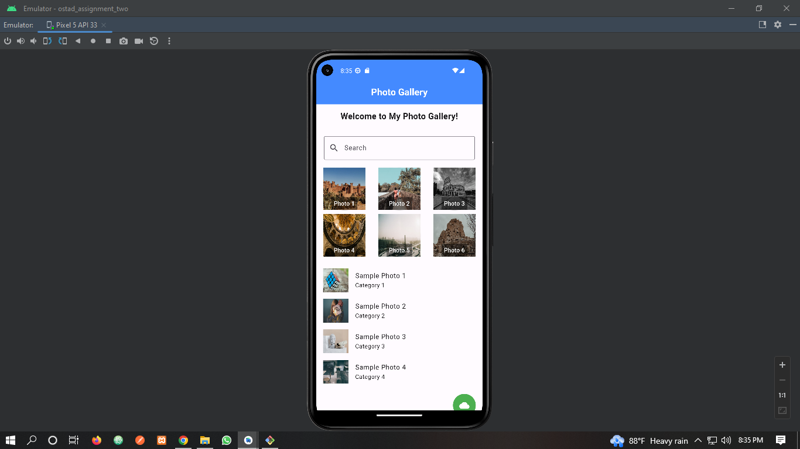

মডিউল ৬ এর এসাইনমেন্ট
1. Create a Flutter app with a Scaffold as the root widget.
2. Implement an AppBar at the top with a title "Photo Gallery".
3. Inside the body of the Scaffold, create a SingleChildScrollView to enable scrolling.
4. Within the SingleChildScrollView, create a Column widget.
5. Inside the Column widget, add a Container to display a welcome message such as "Welcome to My Photo Gallery!".
6. Below the welcome message, create a TextField for users to search for specific photos. Use appropriate styling and placeholder text. No search functionality needed just design the TextField.

7. Implement a Wrap widget to display a grid of photos.
8. The images must be Network Images. You can choose any network image as you like. There must be at least 6 images in the Wrap Widget.
9. Each photo should be represented by an ElevatedButton or OutlineButton with an Image and caption below it.
10. While clicking on each image there should be a Snackbar Showing message “Clicked on photo!”.
11. Add appropriate spacing and styling to the buttons, images, and captions.
12. Use a ListView to display a list of ListTile widgets below the photo grid.
13. Each ListTile should represent a photo with a title and a subtitle. Add at least three sample photos to the list.
14. Implement a button, such as an IconButton, that when pressed, displays a SnackBar with the message "Photos Uploaded Successfully!".

Submission:
15. Github repo link 

# The .readme file in github must contain screenshots of the whole app

