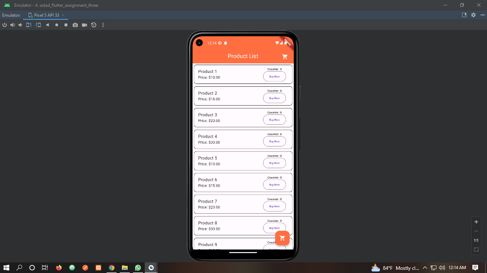
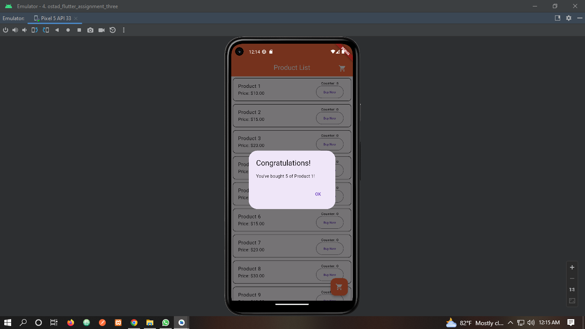
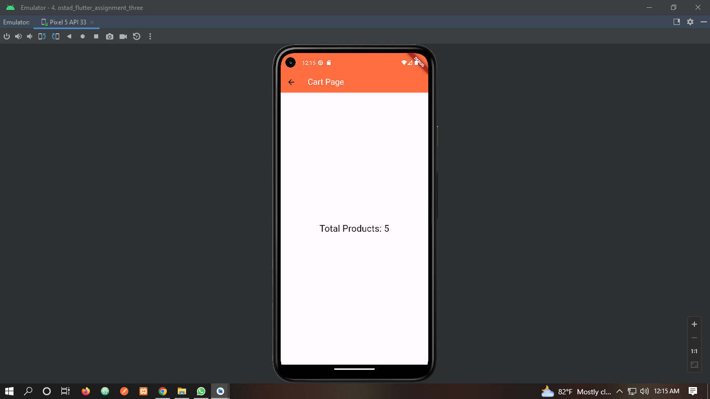

Create a Flutter application that consists of the following:

1. A stateful widget called ProductList that displays a list of products.
2. Each product should have a name, price, and a "Buy Now" button.
3. Implement a counter for each product that increments by 1 every time the "Buy Now" button is pressed.
4. When the counter for a product reaches 5, show a dialog box with the message "Congratulations!
You've bought 5 {Product Name}!" Replace {Product Name} with the actual name of the product.
5. Use the ListView widget to display the product list.
6. Implement navigation to a new page called CartPage when the user presses a "Go to Cart" button.
7. The CartPage should display the total number of products the user has bought.

# Submission Guidelines:
- Github repo link (public)
- Must attach screenshots in README.md file

- Submitting zip, pdf, and docx is not allowed.